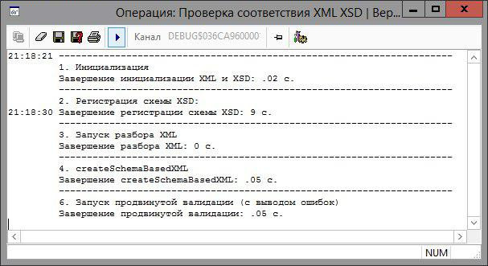

# Проверка xml по xsd

## Краткое описание
Операция демонстрирует возможность проверки xml по xsd как при чтении из файла, так и из справочника.

## Возможное использование

- [X] чтение xsd с диска или его хардкрд в операции (в примере реализованы оба варианта)
- [ ] сохранение xsd в clob в какой-нибудь справочник и работа с ним: для заполнения справочника можно использовать форму с мемо-полем (если XSD небольшой) или импорт из файла.

## Ограничения проверки xml средствами Oracle
 - для схем среднего размера (~20 Кб) регистрация xsd выполняется очень долго (~ 10 секунд)
Жизнеспособный вариант выглядит следующим образом: схема один раз регистрируется и не удаляется; при обновлении схемы xsd зарегистрированные схемы очищаются. Пример работы есть в файле.
 - относительно невысокая скорость работы при больших объёмах данных (xml ~ 10 Мб) проверяется около 1 секунды
 - не очень хорошая диагностика ошибок: далеко не во всех случаях можно понять где ошибка, пользователю её выводить противопоказано (как показал опыт, в большинстве библиотек языков программирования высокого уровня диагностика похожая)
 - некоторые ограничения некорректно обрабатываются

    Например, не читается xsd с типом данных "xs:base64Binary" и ограничением "<xs:maxLength value="102400"/>", при этом он же с ограничением "<xs:maxLength value="10240"/>" работает. Общение на [ряде форумов](https://community.oracle.com/message/14573711#14573711) не привело к положительному решению проблемы; видимо, и впрямь не работает.    
	Если это действительно требуется (например, размер поля не должен превышать 100Кб), то решение следующее: убрать проверку из XSD и добавить в код.

## Содержание

 - поставка    
> xsd_test.mdb    
> xsd_test.pck

 - тестовый пример xml и xsd    
> example\test.xml    
> example\test.xsd    

# Пример работы
простая валидация    

продвинутая валидация    
